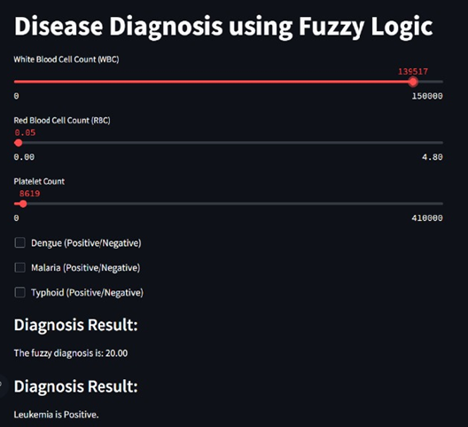

# **Disease Diagnosis Using Fuzzy Logic**

An interactive web application that utilizes fuzzy logic to diagnose potential medical conditions based on user-provided White Blood Cell (WBC) count, Red Blood Cell (RBC) count, and platelet count. The application is built using `Streamlit` and the `skfuzzy` library.

---

## **Table of Contents**
- [Features](#features)
- [Technologies Used](#technologies-used)
- [How It Works](#how-it-works)
- [Setup and Installation](#setup-and-installation)
- [Usage](#usage)
- [Fuzzy Logic Explanation](#fuzzy-logic-explanation)
- [Future Enhancements](#future-enhancements)
- [License](#license)

---

## **Features**
- **User-friendly Interface**: Intuitive sliders and checkboxes for input.
- **Fuzzy Logic-based Diagnosis**: Mimics human reasoning for decision-making.
- **Medical Conditions Covered**:
  - Normal Condition
  - Leukemia
  - Pancytopenia
  - Malaria
  - Typhoid
  - Dengue
  - Mild Infections
- **Custom Recommendations**: Suggests further tests and medical consultation based on the diagnosis.

---

## **Technologies Used**
- **Python**
  - [Streamlit](https://streamlit.io/): For building the web-based GUI.
  - [skfuzzy](https://pythonhosted.org/scikit-fuzzy/): For implementing fuzzy logic.
  - [NumPy](https://numpy.org/): For numerical computations.
  
---

## **How It Works**
1. **User Inputs:**
   - Users provide their medical test values (WBC, RBC, Platelets) using sliders.
   - Users can optionally indicate test results for Dengue, Malaria, and Typhoid using checkboxes.

2. **Fuzzy Logic:**
   - Medical test values are evaluated against predefined fuzzy rules to diagnose potential diseases.

3. **Output:**
   - The application provides a diagnosis based on fuzzy logic computation.
   - If further testing is recommended (e.g., Dengue, Malaria, Typhoid), the application prompts users to indicate their test results.

---

## **Setup and Installation**

### **Prerequisites**
- Python 3.7 or higher
- pip (Python package manager)

### **Installation Steps**
1. Clone this repository:
   ```bash
   git clone https://github.com/yourusername/fuzzy-disease-diagnosis.git
   cd fuzzy-disease-diagnosis
   ```

2. Install the required packages:
   ```bash
   pip install -r requirements.txt
   ```

3. Run the application:
   ```bash
   streamlit run app.py
   ```

4. Open the URL displayed in your terminal to access the application in your browser.

---

## **Usage**
1. Adjust the sliders for:
   - **White Blood Cell (WBC) Count**: Range from 0 to 150,000.
   - **Red Blood Cell (RBC) Count**: Range from 1.0 to 4.8.
   - **Platelet Count**: Range from 0 to 410,000.
   
2. Indicate test results (if available) using the checkboxes:
   - Dengue (Positive/Negative)
   - Malaria (Positive/Negative)
   - Typhoid (Positive/Negative)

3. View the **Diagnosis Result** and recommendations displayed on the interface.

---

## **Fuzzy Logic Explanation**
- **What is Fuzzy Logic?**
  Fuzzy logic mimics human reasoning, working with degrees of truth rather than binary true/false logic.

- **Fuzzy Variables:**
  - **Inputs:** WBC, RBC, and Platelets categorized into ranges like `low`, `normal`, and `high`.
  - **Output:** Diagnosis with categories such as `Normal`, `Leukemia`, etc.

- **Rules:**
  Expert medical knowledge is captured in fuzzy rules, such as:
  ```
  IF WBC is High AND RBC is Low AND Platelets are Low THEN Diagnosis is Leukemia.
  ```

---

## **Future Enhancements**
- Integration with patient health records.
- Expand rules to cover more diseases.

---


## **Preview**


---
